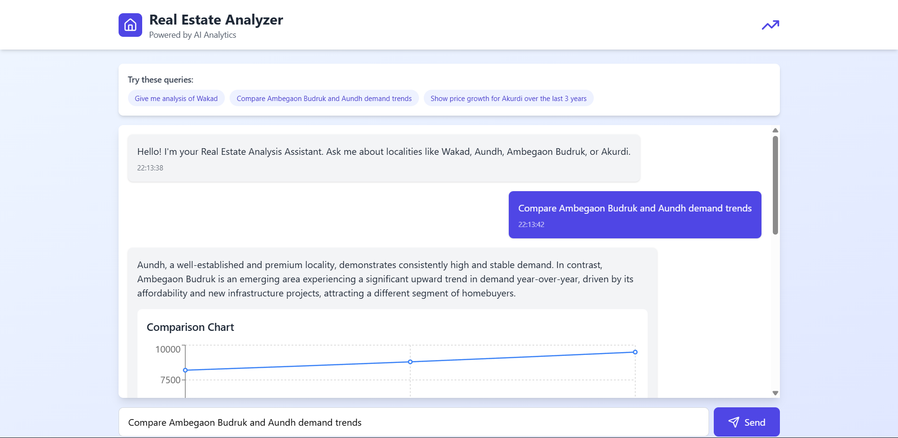

#  Real Estate Analyzer – Full Stack Project  
A full-stack web application that analyzes real-estate Excel files using pandas.  
Built with a **React frontend**, **Django backend**, and deployed on **Vercel + Render**.

---

##  Tech Stack

### **Frontend**
- React (CRA)
- Tailwind CSS
- Recharts, Lucide React
- Axios
- Environment-based API config  
- Deployed on **Vercel**

### **Backend**
- Django 4.x
- pandas, numpy, openpyxl
- django-cors-headers  
- Gunicorn
- Deployed on **Render**

---

##  Local Development Setup

###  1. Clone the Repository
```bash
git clone https://github.com/your-username/real-estate-analyzer.git
cd real-estate-analyzer 
```

###  2. Move into backend folder
```bash
cd backend
```

###  3. Create virtual environment
```bash
python -m venv venv
venv/Scripts/activate      # Windows
source venv/bin/activate   # macOS/Linux
```

###  4. Install required packages
```bash
pip install -r requirements.txt
```

###  5. Run development server
```bash
python manage.py runserver
```

##  Frontend Setup

### 1. Move into frontend folder
```bash
cd frontend
```

### 2. Install dependencies
```bash
npm install
```

### 3. Create .env file
```bash
GEMINI_API_KEY=your-api-key
```

### 4. Start the frontend
```bash
npm start
```


